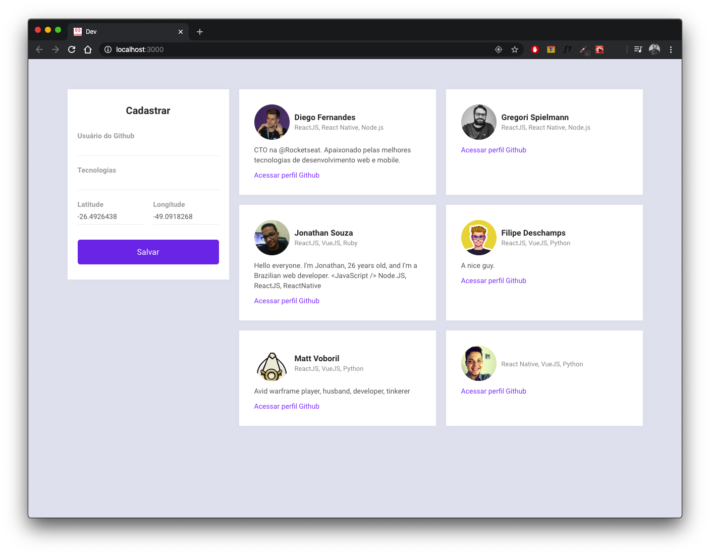
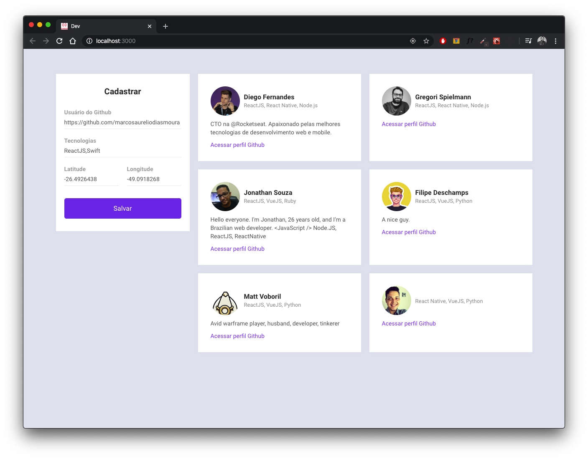
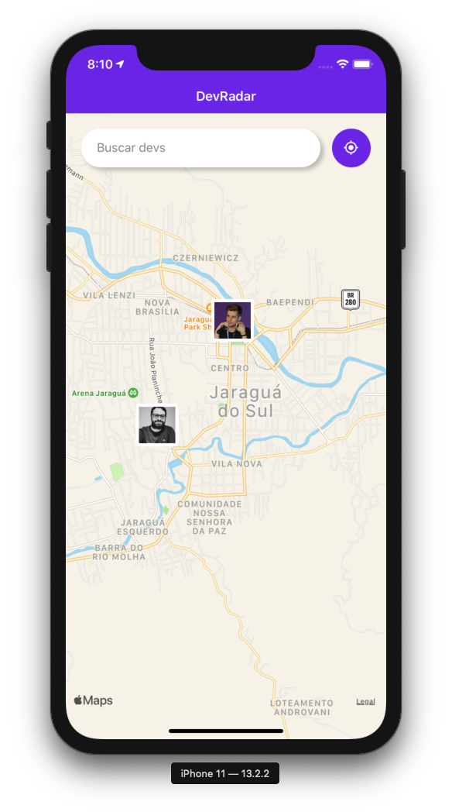
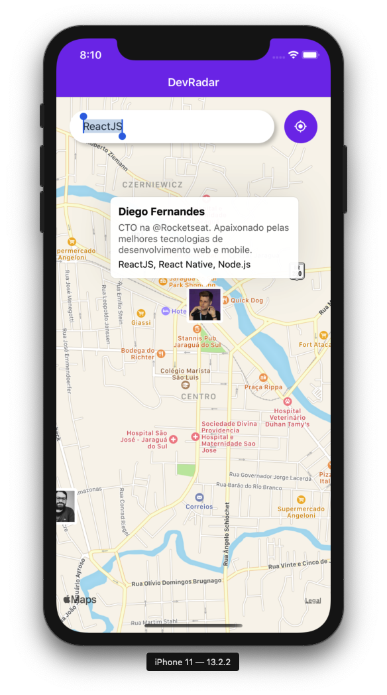
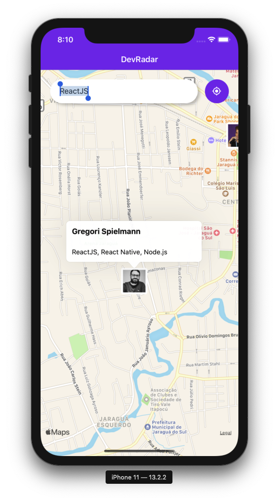
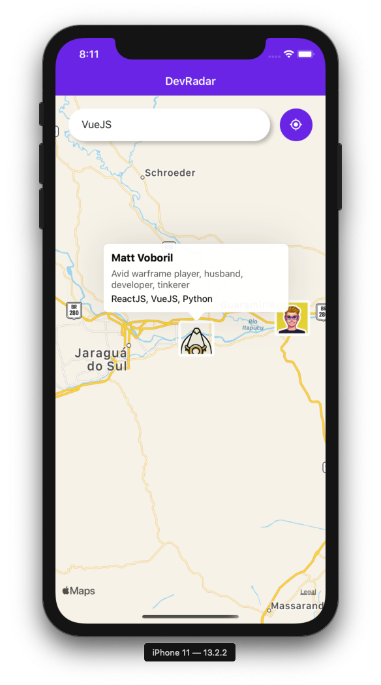

<!--<p align="center">
  <a href="" rel="noopener">
 </a>
</p>-->

<h3 align="center">DevRadar</h3>

<div align="center">

[]()
[](/LICENSE)

</div>

---

<p align="center"> This app is a map with devs that you can find using techs.
<br>
This project born to be a little full stack app to search devs by techs.
    <br> 
</p>

## 📝 Table of Contents

- [About](#about)
- [Getting Started](#getting_started)
- [Usage](#usage)
- [Built Using](#built_using)
- [Authors](#authors)
- [TODO](#todo)

## 🧐 About <a name = "about"></a>

This project was made to be a little full stack app made with ReactJS, React Native and Node.js.

## 🏁 Getting Started <a name = "getting_started"></a>

These instructions will get you a copy of the project up and running on your local machine for development and testing purposes.

### Prerequisites

What things you need to install the software and how to install them.

- [Yarn](https://yarnpkg.com/lang/en/) - Package Manager

### Installing

A step by step series of examples that tell you how to get a development env running.

### Cloning Repo

```
$ git clone https://github.com/gregorispielmann/devradar-omnistack10.git
```

### Database

This project use MongoDB.

### Backend

After create and run all containers, create the postgres database you will be ready to initialize the backend.

Inside the backend folder run commands below.

```
$ yarn
To install all dependencies

$ yarn dev
This will start backend in dev mode

```

### Frontend (Web)

### Demo

<div style="display: flex;">




</div>

### How it runs?

After run backend.

```
$ yarn
To install all dependencies

$ yarn start
To run react application
```

### Mobile (:apple: iOS Only)

### Demo

<div style="display: flex;">






</div>

### How it runs?

After run backend, inside the mobile folder run commands below.

```
$ yarn
To install all dependencies

$ yarn start
To run react application
```

## 🎈 Usage <a name="usage"></a>

### Web

Just run the app and insert github users with location.

### Mobile

You will only need set the tech and push the button

## ⛏️ Built Using <a name = "built_using"></a>

- [NodeJs](https://nodejs.org/en/) - Server Environment
- [Express](https://expressjs.com/) - Server Framework
- [ReactJs](https://reactjs.org/) - Web Framework
- [React Native](https://react-native.org/) - Mobile Framework
- [Styled Components](https://www.styled-components.com/) - CSS in Javascript library
- and others

## ✍️ Authors <a name = "authors"></a>

- [@rockeseat](https://rocketseat.com.br/bootcamp) - Idea & Initial template
- [@gregorispielmann](https://github.com/gregorispielmann) - Back-end, Front-end and Mobile App development

## TODO <a name="todo"></a>

- Android mobile app
- Aditional features to web and mobile
